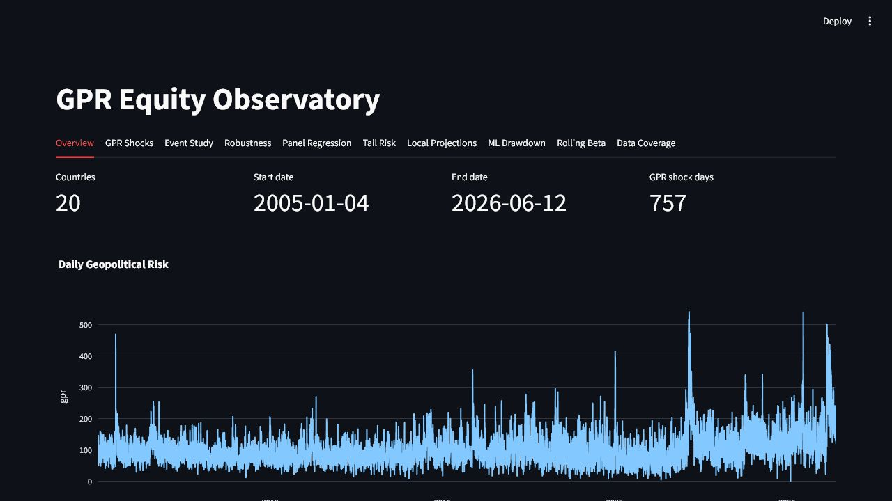

# GPR Equity Observatory

GPR Equity Observatory is a reproducible economics research project on how
equity markets respond to geopolitical risk shocks.

It is built as a profile-ready project: a tested Python data pipeline, empirical
models, an interactive Streamlit dashboard, screenshots, and plain-English
research notes.



## One-Sentence Summary

I built a reproducible quant economics platform studying how geopolitical risk
is associated with equity-market risk across 20 developed and emerging market
country ETF proxies.

## What The Project Does

- Builds a 20-country ETF return panel using free public data.
- Adds the Caldara-Iacoviello geopolitical risk index.
- Compares developed and emerging market ETF responses.
- Runs event studies, panel regressions, quantile regressions, local
  projections, rolling sensitivity estimates, and a simple drawdown-risk model.
- Adds a separate monthly developed/emerging benchmark layer with deterministic
  sample mode, user-supplied real mode, source manifests, HAC regressions, and
  expanding-window forecast comparisons.
- Presents the results in a Streamlit dashboard and written research notes.

This is not a trading system and it is not investment advice. It is an
educational economics project about geopolitical risk, international equity
markets, and empirical research design.

## Main Finding

The current evidence should be reported carefully: the project finds cautious
evidence that geopolitical risk is associated with equity-market risk, but the
emerging-market asymmetry result is mixed and not statistically strong in the
current specification.

The controlled panel regression finds a small negative association between daily
geopolitical-risk jumps and ETF returns. However, the date fixed-effects H1 test
does not find a statistically strong extra emerging-market effect.

In plain English: the project finds evidence that geopolitical risk matters for
equity-market risk, but it should not claim to prove that emerging markets always
react more strongly.

See [reports/RESULTS_BRIEF.md](reports/RESULTS_BRIEF.md) for the short generated
summary.

## For Reviewers

Start here:

- [docs/CHATGPT_WEB_ANALYSIS_GUIDE.md](docs/CHATGPT_WEB_ANALYSIS_GUIDE.md) for
  the most efficient file bundle and review prompts for ChatGPT web or another
  external reviewer.
- [reports/RESULTS_BRIEF.md](reports/RESULTS_BRIEF.md) for the short generated
  result summary.
- [docs/RESEARCH_NOTE.md](docs/RESEARCH_NOTE.md) for the research framing and
  interpretation.
- [docs/TECHNICAL_APPENDIX.md](docs/TECHNICAL_APPENDIX.md) for data, methods,
  and reproducibility details.
- [docs/REVIEWER_GUIDE.md](docs/REVIEWER_GUIDE.md) for 5-minute, 15-minute, and
  30-minute review paths.
- [docs/REPRODUCIBILITY_CHECKLIST.md](docs/REPRODUCIBILITY_CHECKLIST.md) for a
  clean-clone rebuild checklist.
- [docs/PROFILE_PACKAGING.md](docs/PROFILE_PACKAGING.md) for CV, LinkedIn, and
  interview material.
- [docs/LAUNCH_CHECKLIST.md](docs/LAUNCH_CHECKLIST.md) for GitHub/profile launch
  steps.
- [reports/screenshots](reports/screenshots) for dashboard images.
- [docs/SCREENSHOT_REFRESH.md](docs/SCREENSHOT_REFRESH.md) for the screenshot
  refresh process.

## Why This Works As A Profile Project

This project shows more than one isolated chart or model. It demonstrates:

- economics research framing
- data collection and cleaning
- reproducible Python workflow
- econometric modelling
- cautious interpretation of statistical evidence
- dashboard communication
- testing and continuous integration

The most important strength is honesty: the project reports mixed evidence
instead of forcing a dramatic result.

## Quick Start

Install the regular development environment:

```powershell
python -m pip install -r requirements.txt
```

For an exact resolved environment, use the committed lock file:

```powershell
uv sync --all-extras
```

Rebuild the daily data and results:

```powershell
python scripts/build_all.py
```

Use the unified task runner for targeted daily/monthly workflow checks:

```powershell
python scripts/run_task.py build-daily
python scripts/run_task.py monthly-sample --min-train-months 24
python scripts/run_task.py lint
python scripts/run_task.py test
```

The monthly sample pipeline is deterministic and is intended for software
validation and CI. It is not empirical evidence.

To run the monthly real benchmark, copy `config/sources.sample.yml` to
`config/sources.yml`, point it at local GPR and Kenneth French factor files, and
run:

```powershell
python scripts/run_task.py build-monthly-real
python scripts/run_task.py validate-monthly-real
```

`config/sources.yml`, raw files, and real generated outputs are local-only and
ignored by Git.

Run the dashboard:

```powershell
streamlit run app.py
```

Run the checks:

```powershell
ruff check .
pytest --cov=gprobs --cov=app --cov-report=term-missing -q
```

The build commands download public data and write generated files into
`data/raw/`, `data/processed/`, `data/metadata/`, `reports/tables/`, and
`reports/figures/`. Those generated folders are intentionally not committed to
Git by default.

`requirements.txt` is the editable development install. `uv.lock` is the exact
resolved dependency graph for reproducible rebuilds.

## Repository Map

```text
app.py                         Streamlit dashboard
data/country_universe.csv      20-country ETF universe
scripts/build_all.py           Daily rebuild pipeline
scripts/run_task.py            Unified task runner for daily/monthly commands
scripts/build_*.py             Data construction scripts
scripts/run_*.py               Empirical model scripts
scripts/write_results_brief.py Plain-English results summary
src/gprobs/                    Reusable project code
tests/                         Data and feature checks
reports/RESULTS_BRIEF.md       Short generated findings summary
reports/screenshots/           Dashboard screenshots for profile use
docs/PROJECT_STATUS.md         Current implementation and results status
docs/CHATGPT_WEB_ANALYSIS_GUIDE.md  Efficient context bundle for ChatGPT web
docs/REVIEWER_GUIDE.md         5-minute, 15-minute, and 30-minute review paths
docs/REPRODUCIBILITY_CHECKLIST.md  Clean-clone rebuild checklist
docs/SCREENSHOT_REFRESH.md      Dashboard screenshot refresh process
docs/LAUNCH_CHECKLIST.md        GitHub/profile launch checklist
docs/RESEARCH_NOTE.md          Applied economics research note draft
docs/TECHNICAL_APPENDIX.md     Data, model, and reproducibility details
docs/PROFILE_PACKAGING.md      CV, LinkedIn, and interview materials
```

## Methods Included

- ETF daily log returns
- GPR shock event studies
- Market-model abnormal returns
- Panel regressions with market controls
- Sample robustness checks
- Quantile regressions for downside-risk analysis
- Local projections for abnormal-return response paths
- Rolling GPR sensitivity estimates
- Prediction Lab with out-of-sample drawdown-risk classification, calibration,
  lift, threshold metrics, and country risk summaries
- Monthly developed/emerging benchmark HAC regressions
- Monthly expanding-window forecast comparisons

## Important Limitations

- ETF returns are USD returns, so they combine local equity-market movement and
  currency exposure against the US dollar.
- Daily ETF findings and monthly aggregate benchmark findings answer related
  but different questions and should not be mixed as one panel.
- Monthly sample mode proves the workflow runs; it does not support empirical
  market claims.
- The two-market monthly benchmark is useful as an aggregate comparison, not as
  credible country-clustered panel inference.
- The results are associations, not clean causal estimates.
- Free market data can contain revisions, missing values, or provider limits.
- The current project runs locally. Public dashboard deployment is a separate
  optional step because generated data files are not committed by default.

## Profile Materials

Use [docs/PROFILE_PACKAGING.md](docs/PROFILE_PACKAGING.md) for:

- a CV bullet
- a LinkedIn summary
- interview talking points
- a three-minute walkthrough script
- what not to overclaim

Screenshots are already saved in [reports/screenshots](reports/screenshots).

## Sources

- Caldara and Iacoviello Geopolitical Risk Index:
  <https://www.policyuncertainty.com/gpr.html>
- Caldara, Dario, and Matteo Iacoviello. 2022. "Measuring Geopolitical Risk."
  American Economic Review.
- ETF and market proxy data are retrieved through `yfinance` for educational
  research use.
- The dashboard is built with Streamlit.
