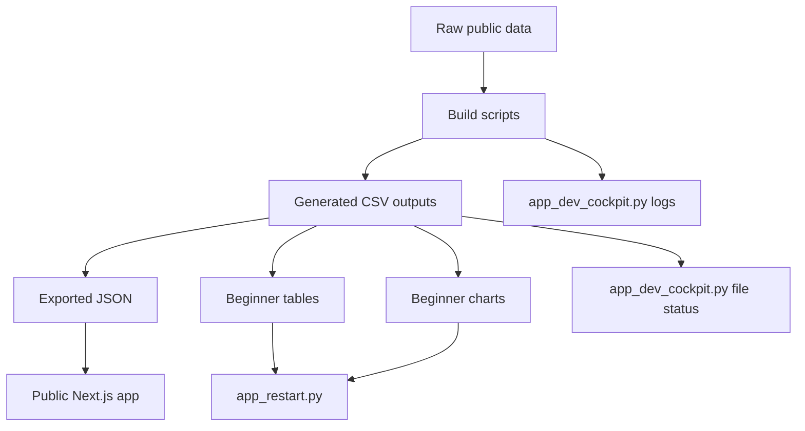

# 01 - Simple Architecture

## Plain-English architecture

```text
Raw data
  goes into
Build scripts
  which create
Clean CSV files
  which feed
Readable Streamlit pages
  and exported JSON for the public Next.js app
  which show
Charts, tables, and explanations
```

## The two-layer design

### Layer 1: serious engine

This is the original project.

It downloads data, builds panels, runs regressions, runs event studies, runs prediction diagnostics, and creates output CSVs.

Main folders:

```text
scripts/
src/gprobs/
data/
reports/
```

### Layer 2: beginner front door

This is the new layer.

It does not redo the research.
It reads the output CSVs and explains them.
It is local and beginner-facing; it does not replace the public `frontend/`
app.

Main files:

```text
app_restart.py
app_dev_cockpit.py
docs/beginner/
```

## Why this architecture is easier

The beginner layer only needs to understand CSV files.

That means you can think like this:

```text
What CSV do I need?
What columns matter?
What should the user-facing column names be?
What does each row mean in plain English?
What chart shows it best?
```

## Diagram



## Important principle

Do not make the UI read raw model tables directly.

Always translate raw tables into readable tables first.
